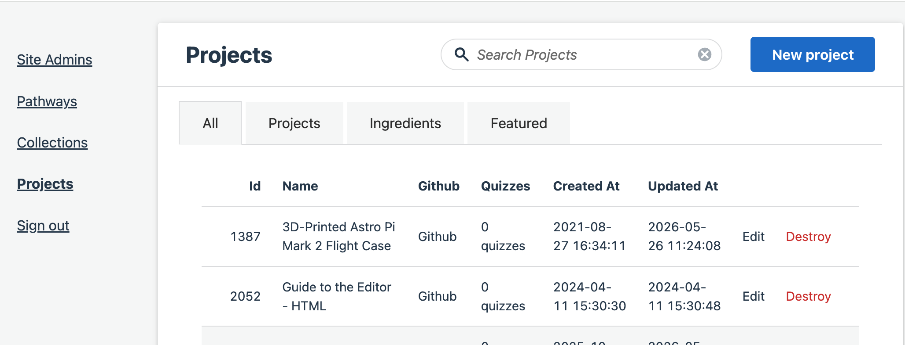
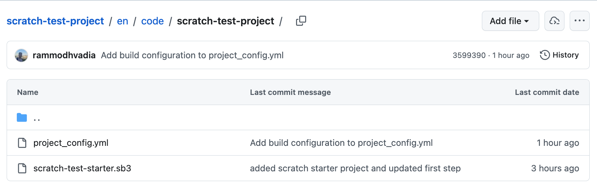
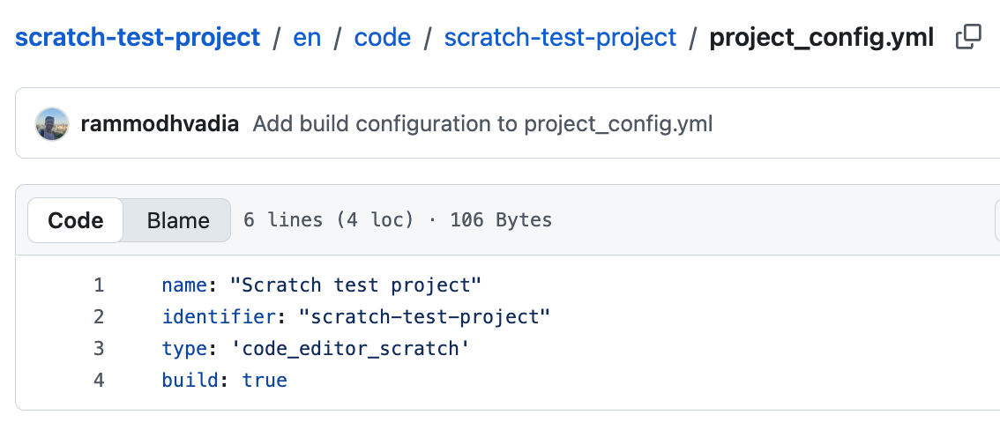

## Integrated Scratch Projects
This project is meant to be a test project which demonstrates the integrated Scratch functionality.

### Instructions for setting up an integrated scratch project
1. Go to Projects Admin and click "New Project"

2. Fill out the project data as normal, making sure to select `Direct to Editor` and adding a name for your starter project.
 
3. When the corresponding GitHub repo is created, you can add your Scratch starter project to the code/starter-project/ folder. Make sure that the name of this folder matches the name you used. Delete any Python files that were added by default.

4. You will need to update the `project_config.yml` to account for the Scratch project. Make sure that:
    - Name + identifier matches the editor starter project name
    - `type` should be set to `code_editor_scratch`.
    - `build` should be set to `true`
